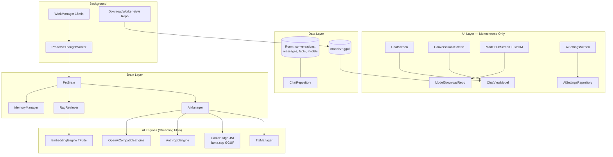

# GooseDroid AI System Upgrade: Full MAID Feature Parity + Memory/RAG/Autonomous

## Goal Description

อัปเกรด MobileBot (GooseDroid) ให้มีฟีเจอร์ครบตามโปรเจกต์ MAID (Mobile-Artificial-Intelligence/maid) ทุกข้อ พร้อมระบบ Memory/RAG/Autonomous จากงานวิจัยก่อนหน้า (PocketSage, LocalMind, Ferry):

| MAID Feature | สถานะปัจจุบัน | แผน |
|---|---|---|
| Local inference (GGUF via llama.cpp) | ❌ Stub mock | Phase 5 |
| Remote providers (Anthropic/DeepSeek/Mistral/Novita/Ollama/OpenAI) | ⚠️ OpenAI-compatible เท่านั้น | Phase 3 |
| One-tap model downloads | ⚠️ DownloadManager พื้นฐาน | Phase 4 |
| Bring your own model (GGUF จาก storage) | ❌ | Phase 5 |
| Conversation management (create/rename/delete/export/import JSON) | ❌ | Phase 1 |
| Customisable parameters (temp/top-p/top-k/context) | ❌ | Phase 3 |
| Custom system prompt + persona | ⚠️ persona รายตัวละครเท่านั้น | Phase 3 |
| Voice output (TTS) | ❌ | Phase 8 |
| Account sync (Supabase) | ❌ | Phase 9 (Optional) |
| Light/Dark theming | ⚠️ Dark monochrome เท่านั้น | Phase 0 |

> [!IMPORTANT]
> **ข้อจำกัด UI (บังคับสูงสุด)**: ทุกหน้าจอ/Component ใช้ Monochrome Palette
> (`Tdsm*`) — ดำ, ขาว, เทา เท่านั้น **ห้ามมีสีฉูดฉาด**
> Light/Dark mode = กลับขั้ว palette เท่านั้น (ไม่ใช้ Material You dynamic color)

## User Review Required

- **Single module** คง `:app` เดียว (consistent กับโค้ดเดิม)
- **Phase 5 ต้องเพิ่ม NDK + CMake** (llama.cpp compile เป็น .so) — build จะหนักขึ้น, APK เพิ่ม ~5-15MB ต่อ ABI (แนะนำ arm64-v8a อย่างเดียว)
- **Anthropic ไม่ใช้ OpenAI format** (`/v1/messages` + header `x-api-key`) ต้องทำ adapter แยก
- **Phase 9 (Supabase)** เป็น optional — ผู้ใช้ต้องสมัคร Supabase project เอง

---

## Proposed Changes

### Phase 0 — Build Setup + Monochrome Light/Dark Theme

#### [MODIFY] app/build.gradle.kts
- ย้าย deps ไปใช้ version catalog aliases (Room/KSP/Work พร้อมใน toml แล้ว)
- เตรียม `externalNativeBuild` placeholder สำหรับ Phase 5

#### [MODIFY] ui/theme/Color.kt + Theme.kt
- เพิ่ม **Light Monochrome scheme**: bg `#FFFFFF`, surface `#F5F5F5`, border `#DDDDDD`,
  textPrimary `#111111`, muted `#888888`
- Dark scheme = ค่าปัจจุบัน (bg ดำสนิท)
- เลือก scheme ตาม `isSystemInDarkTheme()` + override ใน settings

#### [REFACTOR] ทุก Screen
- แทน hardcoded `Color(0xFFFFFFFF)` / `Color.Black` ใน ChatScreen/EditorScreen
  ฯลฯ ด้วย semantic colors (`TdsmTextPrimary` ฯลฯ) เพื่อรองรับ light mode

### Phase 1 — Room Database + Conversation Management

> [!NOTE]
> Pattern จาก Maid-Native: conversation tree แบบ entity แยกจาก message

#### [NEW] data/local/
- `ConversationEntity` (id, characterName, title, createdAt, updatedAt)
- `ChatMessageEntity` (id, conversationId FK, sender, text, actionBadge,
  timestamp, isFromUser)
- `ChatDao`, `ConversationDao` (Flow queries)
- `GooseDatabase` singleton

#### [NEW] data/ChatRepository.kt
- CRUD conversations, observe messages, export/import JSON
  (`kotlinx.serialization` — format เดียวกับ MAID: array ของ {role, content})

#### [NEW] ui/viewmodel/ChatViewModel.kt
- `StateFlow<ChatUiState>` (conversations, activeMessages, isTyping, streamingText)

#### [NEW] ui/screens/ConversationsScreen.kt
- รายการแชท: create / rename (dialog) / delete / export (SAF) / import (SAF)

#### [MODIFY] ui/screens/ChatScreen.kt
- collect จาก ViewModel แทน `remember {}`, auto-scroll, ปุ่ม "new chat"

### Phase 2 — Memory System (Sliding Window + Summarization)

#### [NEW] brain/MemoryManager.kt
```
buildContext(conversationId):
  summary เก่า + 20 messages ล่าสุด
  ถ้า history > 40 → LLM summarize ชุดเก่า → เก็บ conversation_summaries
```
#### [MODIFY] ai/AiManager.kt, brain/PetBrain.kt
- ใช้ MemoryManager แทน `CharacterRegistry.getInteractionContext()`

### Phase 3 — Multi-Provider Cloud + Streaming + Generation Params

#### [MODIFY] ai/AiSettingsRepository.kt
```kotlin
enum class Provider { OPENAI, ANTHROPIC, DEEPSEEK, MISTRAL, NOVITA, OLLAMA, CUSTOM }
data class ProviderProfile(provider, baseUrl, apiKey(encrypted), modelName)
data class GenerationParams(temperature=0.7f, topP=0.95f, topK=40,
                            contextLength=4096, maxTokens=1024)
// + GlobalSystemPrompt, VoiceEnabled, ThemeMode(dark/light/system)
```

#### [MODIFY] ai/AiEngine.kt (interface)
```kotlin
suspend fun generate(prompt, systemPrompt, params): String
fun generateStream(...): Flow<String>   // token-by-token (SSE)
```

#### [NEW] ai/providers/
- `OpenAiCompatibleEngine` (OpenAI/DeepSeek/Mistral/Novita/Ollama — preset URLs)
- `AnthropicEngine` (`/v1/messages`, `x-api-key`, `anthropic-version`)
- SSE parsing ด้วย OkHttp (`text/event-stream`) → callbackFlow

#### [MODIFY] ai/AiManager.kt
- รวม GlobalSystemPrompt + persona + MemoryContext + RAG context
- Streaming: accumulate tokens → บันทึกลง DB เมื่อจบ

#### [MODIFY] ui/screens/AiSettingsScreen.kt
- Provider dropdown (preset URL auto-fill), API key field, model name,
  Sliders temp/top-p/top-k/context (monochrome track/thumb), global system prompt box

### Phase 4 — One-tap Model Downloads (Ferry Pattern)

#### [NEW] data/model/ModelDownloadRepository.kt
- OkHttp streaming → `Flow<DownloadProgress>` (percent, MB/s, ETA)
- Preflight disk space, atomic `.tmp` rename, SHA-256 verify, HTTP Range resume
- Registry table `downloaded_models` ใน Room

#### [MODIFY] ui/screens/ModelHubScreen.kt
- Catalog ขยาย: Qwen, Phi, TinyLlama, Gemma, LFM (curated list แบบ MAID)
- One-tap card: AVAILABLE → DOWNLOADING(progress bar เทา/ขาว) → VERIFYING → READY
- Cancel/resume buttons

### Phase 5 — Local Inference (llama.cpp JNI) + BYOM

> [!WARNING]
> Feature หนักสุด: NDK + CMake compile llama.cpp → `libllama.so`

#### [NEW] cpp/CMakeLists.txt + cpp/llama_jni.cpp
- โครงสร้างตาม official llama.cpp `examples/llama.android`
- JNI: `nativeInit(modelPath, nCtx, nGpuLayers)`, `nativeCompletion(prompt, params, callback)`
- Token callback → Kotlin Flow (streaming จริง)

#### [NEW] ai/local/LlamaBridge.kt
- Load model จาก `filesDir/models/*.gguf`, thread-safe context lock

#### [MODIFY] ai/LocalAiEngine.kt
- ลบ stub → ต่อ LlamaBridge จริง + chat template รายโมเดล

#### [MODIFY] ModelHubScreen + ui/screens/components/BYOMCard.kt
- "Import GGUF" → SAF `ACTION_OPEN_DOCUMENT` copy เข้า models dir → READY

#### [MODIFY] app/build.gradle.kts
- `externalNativeBuild { cmake }`, `abiFilters += "arm64-v8a"`

### Phase 6 — RAG Long-Term Memory

#### [NEW] ai/embedding/EmbeddingEngine.kt
- MiniLM-L6-v2 TFLite (~23MB ดาวน์โหลดผ่านระบบ Phase 4) → FloatArray(384)

#### [MODIFY] data/local/ (memory_facts table + BLOB vector)
#### [NEW] brain/RagRetriever.kt
- Extract facts (LLM) → embed → cosine top-K → ยัด "RELEVANT MEMORIES" ใน prompt

### Phase 7 — Background Autonomous (WorkManager)

#### [NEW] services/ProactiveThoughtWorker.kt
- PeriodicWork 15 นาที: เลือกตัวละคร → LLM สร้างคำพูด proactive → broadcast OverlayService
#### [MODIFY] AiSettingsScreen — toggle "Autonomous Mode" (monochrome switch)

### Phase 8 — Voice Output (TTS)

#### [NEW] voice/TtsManager.kt
- `android.speech.tts.TextToSpeech`, queue ประโยค speech จาก directive
- Toggle ใน settings + ปุ่ม speaker ใน ChatScreen (icon ขาว/เทา)

### Phase 9 — Account Sync (OPTIONAL)

#### [NEW] data/sync/SupabaseSyncRepository.kt
- `supabase-kt`: Auth (register/login) + Postgrest backup chats/settings
- Conflict resolve ด้วย updatedAt, UI: SyncScreen (login/register/status)
- ทำเมื่อทุก phase ก่อนเสร็จและผู้ใช้ยืนยันว่าต้องการ

---

## Architecture Overview



---

## Verification Plan

### Automated
- Unit: MemoryManager (window/summary trigger), RagRetriever (cosine ranking),
  provider URL/header builders (esp. Anthropic adapter), export/import JSON roundtrip
- Instrumented: DAO CRUD, migration smoke test
- Build: `gradle_build(":app:assembleDebug")` ทุก Phase; Phase 5 เพิ่ม check `.so` ถูก pack

### Manual (Device/Emulator arm64)
1. P0: สลับ system dark↔light → ทุกหน้ายัง monochrome ถูกขั้ว ✓
2. P1: สร้าง/เปลี่ยนชื่อ/ลบ/export/import แชท, ปิดแอปเปิดใหม่ประวัติอยู่
3. P2: คุย >40 msg → summary ถูกสร้าง, context ไม่ overflow
4. P3: สลับ provider ทุกตัว (Ollama local, DeepSeek, Anthropic) → ตอบได้ + ตัวอักษรไหลทีละ token
5. P4: ดาวน์โหลดโมเดล เห็น %/speed, cancel, resume จาก network หลุด
6. P5: โหลด Qwen-0.5B GGUF → ตอบจริงบนเครื่อง offline, BYOM import ไฟล์เอง
7. P6: เล่า "แพ้กุ้ง" → ปิดแอป → ถามเมนูเย็นนี้ → AI เตือนเรื่องแพ้
8. P7: เปิด Autonomous → รอ 15 นาที → sprite ทักเอง
9. P8: เปิดเสียง → AI พูดตอบ (TTS)
10. **ทุก Phase**: audit UI ทั้งแอป = ดำ/ขาว/เทาเท่านั้น

### Execution Order
P0 → P1 → P2 → P3 → P4 → P5 → P6 → P7 → P8 → (P9 เมื่อ confirm)
เหตุผล: foundation ก่อน (DB/theme), engine ระยะไกลก่อน local (P5 build หนัก),
RAG ต้องมีระบบ download (P4) และ memory (P2) ก่อน
